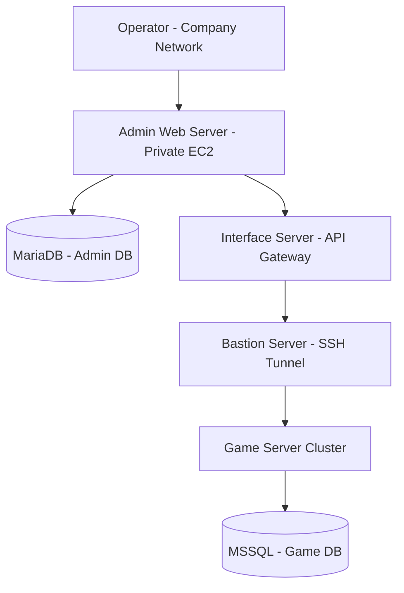

# System Architecture

This document describes the system architecture of the **The Ruler of The Land W Operations Platform**.

---

## Architecture Overview

The operations platform was designed using an **AWS-based 3-Tier Architecture** to support secure and controlled game service operations.

The system separates the administration platform, interface layer, and game servers into different roles to ensure security and operational stability.

Game servers were isolated from external networks, and all operational requests from the admin platform were routed through an **interface server** before reaching the game servers.

---

## Architecture Diagram

---
## Infrastructure

The system infrastructure was deployed on AWS and separated into multiple components to ensure secure and stable operation of the game service.

- **Admin Web Server**  
  Provides the web interface used by game operators.  
  Operators can perform tasks such as managing announcements, granting items, and querying user data.

- **Interface Server**  
  Acts as a gateway between the admin platform and the game servers.  
  It receives requests from the admin platform and forwards operational commands to internal game servers.

- **Bastion Server**  
  Provides secure access to internal infrastructure.  
  Communication with game servers is performed through SSH tunneling via the bastion server.

- **Game Server Cluster**  
  Hosts the core game services and processes operational commands from the admin platform.

- **Database Layer**  
  - **MariaDB** is used for the admin platform database.  
  - **MSSQL** is used for the game service database.

