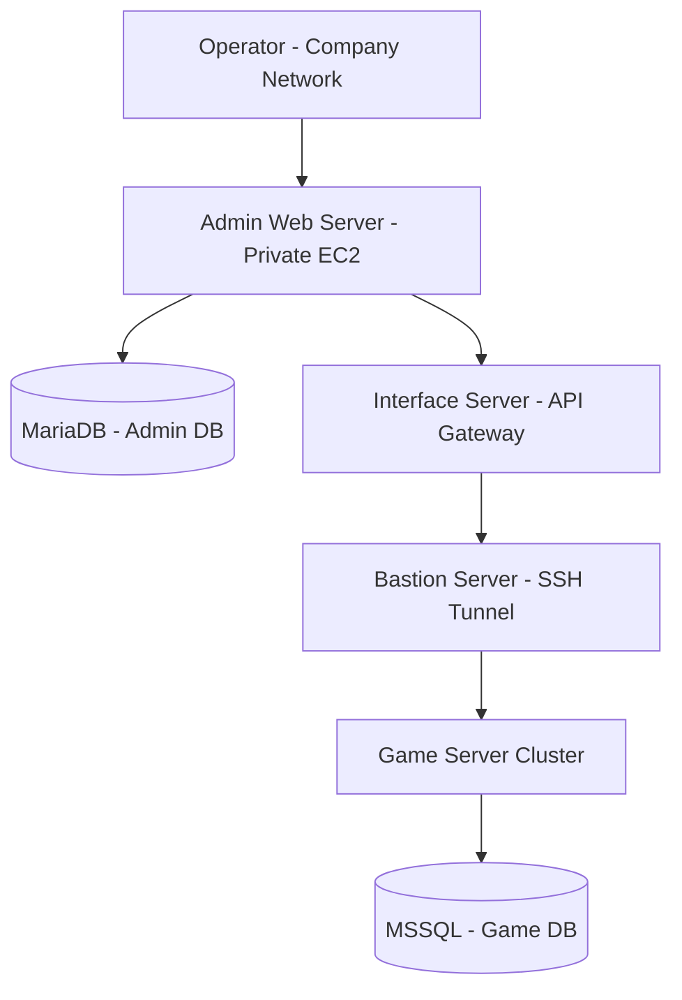

# System Architecture

This document describes the system architecture of the **The Ruler of The Land W Operations Platform**.

---

## Architecture Overview

The operations platform was designed using an **AWS-based 3-Tier Architecture** to support secure and controlled game service operations.

The system separates the administration platform, interface layer, and game servers into different roles to ensure security and operational stability.

Game servers were isolated from external networks, and all operational requests from the admin platform were routed through an **interface server** before reaching the game servers.

---

## Architecture Diagram

---
## Infrastructure Layout
The infrastructure was deployed on AWS and organized into multiple layers to separate operational tools and game services.

### Admin Web Server

The admin web server provides the web-based interface used by game operators.  
Operators can perform operational tasks such as managing announcements, granting items, and querying user data through this system.

### Interface Server

The interface server acts as a gateway between the admin platform and the game servers.

It receives operational requests from the admin platform and forwards them to the internal game servers using predefined API commands.

### Bastion Server

The bastion server provides secure access to internal game infrastructure.

The interface server communicates with game servers through SSH tunneling via the bastion server.
---
## Network & Security
Several security measures were applied to protect the game infrastructure and restrict unauthorized access.

- The admin platform was accessible only from **whitelisted company IP addresses**.
- All admin servers were deployed in **private subnets** to prevent direct public access.
- Game servers were isolated from external networks and could not be accessed directly.
- Access to internal game servers required **SSH tunneling through a bastion server**.
- All operational commands were routed through the **interface server**, preventing direct communication with game servers.

These measures ensured that the game infrastructure remained secure while still allowing operators to perform necessary administrative tasks.

### Game Server Cluster

The game server cluster hosts the core game services and processes operational commands such as item grants and event management.
