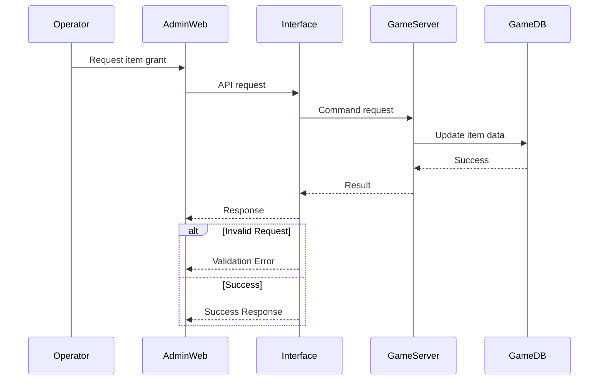

## Business Flow

---

## 📌 Flow Description

When an operator requests an item grant, the request is sent from the Admin Web to the Interface Server.

The Interface Server validates the request and transforms it into a format that the Game Server can process.
The Game Server then performs the actual update on the game database.

The result is returned through the same path back to the Admin Web.

In this architecture, the Game Server is never directly exposed to external systems.
All communication is strictly routed through the Interface Server.

---

## 🔐 Role of the Interface Server

The Interface Server plays a critical role in the system:

* Validates incoming requests (authorization, parameter validation)
* Transforms requests into internal command formats
* Acts as a gateway between external admin systems and internal game servers
* Logs all operations for auditing and traceability
* Handles error responses and standardizes communication

This ensures both security and operational stability.

---

## ⚠️ Error Handling

Several failure scenarios may occur during the item grant process:

* Invalid user ID or request parameters
* Game Server processing failure
* Network communication errors

In such cases, the Interface Server captures the error, standardizes the response,
and sends a consistent error message back to the Admin Web.

All errors are logged for future analysis and troubleshooting.

---

## 🔒 Security Considerations

* Game Servers are fully isolated from external networks
* Direct access to Game Servers is strictly prohibited
* All requests must pass through the Interface Server
* Sensitive operations are protected by authorization checks

This design prevents unauthorized access while enabling controlled operations.
