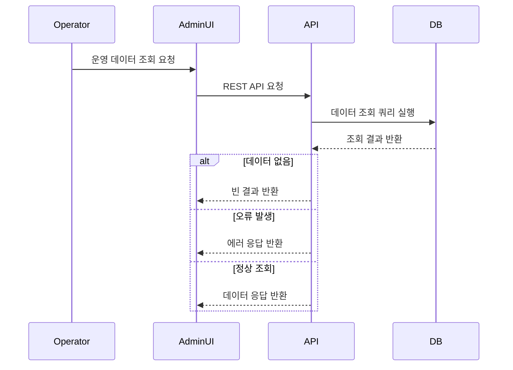

# 데이터 흐름

## 사용자 요청 흐름

---

## 📌 흐름 설명

운영자가 Admin UI를 통해 데이터를 조회하면,
해당 요청은 REST API를 통해 백엔드 서버로 전달됩니다.

백엔드는 요청을 처리하여 데이터베이스에 조회 쿼리를 수행하고,
그 결과를 다시 Admin UI로 반환합니다.

이 구조는 전형적인 **클라이언트-서버 기반 데이터 조회 흐름**으로,
운영자가 필요한 정보를 실시간으로 확인할 수 있도록 설계되었습니다.

---

## 🧩 설계 의도

* **계층 분리 (Layered Architecture)**
  UI, API, DB를 명확히 분리하여 유지보수성과 확장성을 확보

* **REST 기반 통신**
  표준 HTTP 프로토콜을 사용하여 클라이언트와 서버 간 통신 단순화

* **단일 책임 원칙 적용**
  각 계층은 자신의 역할(UI, 비즈니스 로직, 데이터 처리)에만 집중

---

## ⚠️ 고려 사항

* 대량 데이터 조회 시 성능 저하 가능성
* API 응답 시간 증가에 따른 사용자 경험 저하
* 데이터 정합성 및 최신성 유지 필요

이에 따라 페이징 처리, 캐싱 전략, 쿼리 최적화 등의 추가 설계가 필요합니다.
