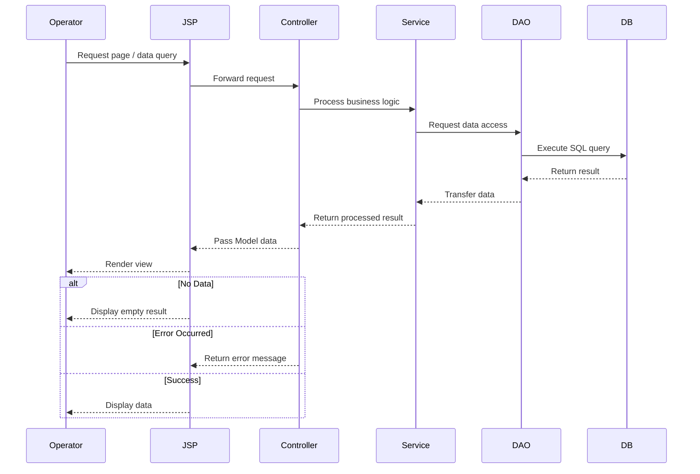

# Data Flow

## User Request Flow

---

## 📌 Flow Description

When an operator requests data through the UI, the request is handled by a JSP page and forwarded to the Controller.

The Controller delegates the request to the Service layer, where business logic is processed.
The Service then interacts with the DAO layer to retrieve data from the database.

The retrieved data is passed back through the Service and Controller layers,
and the Controller places the data into the Model.

Finally, the JSP renders the view using the provided data and returns it to the operator.

---

## 🧩 Design Principles

* **MVC Pattern**
  The system follows a Model-View-Controller architecture to clearly separate responsibilities.

* **Layered Architecture**
  Each layer (Controller, Service, DAO) is responsible for a specific role.

* **Server-Side Rendering**
  JSP is used to generate views on the server, ensuring compatibility with legacy systems.

---

## ⚠️ Considerations

* Increased server load due to server-side rendering
* Potential coupling between view and business logic
* Performance issues when handling large data sets

To address these issues, pagination, query optimization, and caching strategies can be applied.
