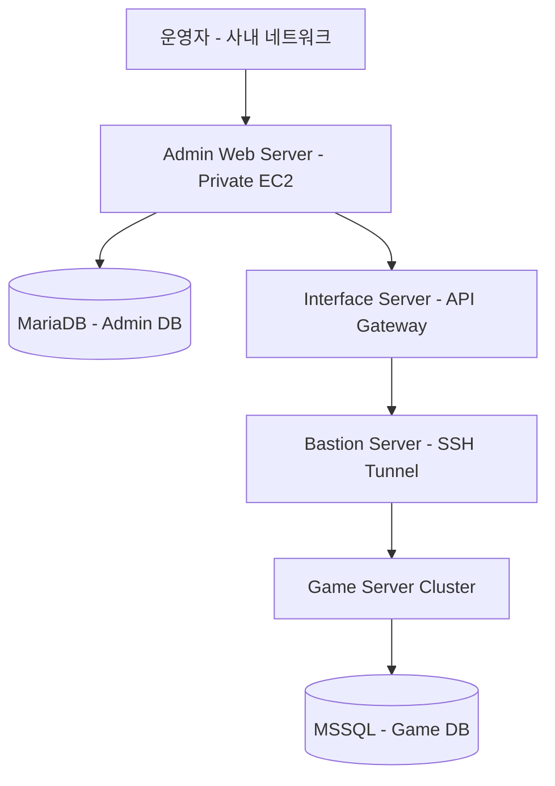
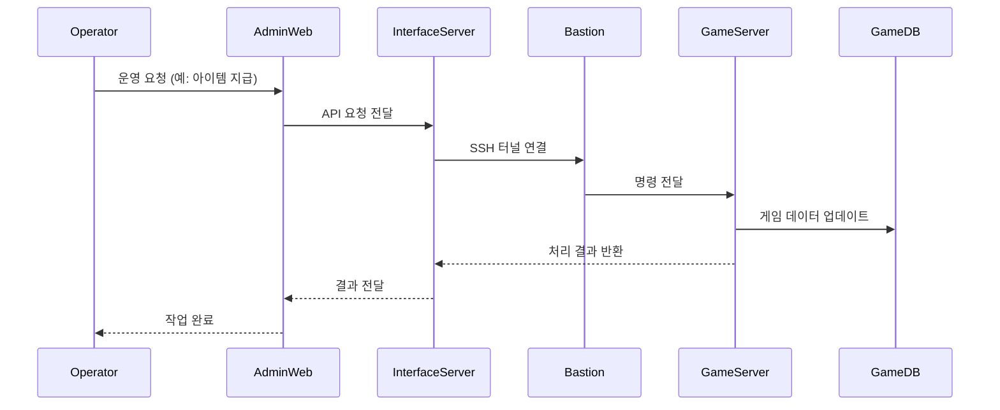

# 시스템 아키텍처

본 문서는 **열혈강호 W(The Ruler of The Land W) 운영 플랫폼**의 시스템 아키텍처를 설명합니다.

---

## 📌 아키텍처 개요

운영 플랫폼은 보안성과 안정적인 운영을 위해 **AWS 기반 3-Tier 아키텍처**로 설계되었습니다.

본 시스템은 다음과 같은 역할 분리를 통해 구성됩니다:

* 운영자가 사용하는 **Admin 플랫폼**
* 요청을 중계하고 검증하는 **Interface Layer**
* 실제 게임 로직을 처리하는 **Game Server 영역**

특히, 게임 서버는 외부 네트워크와 완전히 분리된 환경에서 운영되며,
모든 운영 요청은 반드시 **Interface Server를 통해서만 전달되도록 설계**되었습니다.

---

## 🏗 아키텍처 다이어그램

---

## 🧩 인프라 구성

본 시스템은 AWS 환경에서 구축되었으며, 각 컴포넌트는 보안성과 운영 안정성을 고려하여 분리되었습니다.

### 🔹 Admin Web Server

* 운영자가 사용하는 웹 인터페이스 제공
* 공지 관리, 아이템 지급, 유저 조회 등 운영 기능 수행

### 🔹 Interface Server

* Admin 플랫폼과 게임 서버 사이의 **중계 서버**
* 외부 요청을 검증하고 내부 명령 형태로 변환
* 게임 서버로 요청 전달 및 응답 수신

### 🔹 Bastion Server

* 내부 인프라에 대한 **보안 접근 경로 제공**
* SSH 터널링을 통해 게임 서버와의 통신 수행

### 🔹 Game Server Cluster

* 실제 게임 서비스 로직 수행
* 운영 요청(아이템 지급 등)을 처리

### 🔹 데이터베이스 계층

* **MariaDB**: 운영 플랫폼(Admin) 데이터 관리
* **MSSQL**: 게임 서비스 데이터 관리

---

## 🔄 통신 흐름

---

## 🔐 설계 포인트

### 1. 네트워크 격리

* 게임 서버는 외부 네트워크와 완전히 분리
* 직접 접근 불가능하도록 설계

### 2. Interface Server 중심 구조

* 모든 요청을 단일 진입점으로 통제
* 요청 검증, 변환, 로깅 기능 수행

### 3. Bastion 기반 보안 통신

* SSH 터널링을 통한 내부 접근 제어
* 외부에서 게임 서버 직접 접근 차단

### 4. 데이터 분리 전략

* 운영 데이터와 게임 데이터를 분리
* 시스템 간 의존도 최소화 및 안정성 확보
