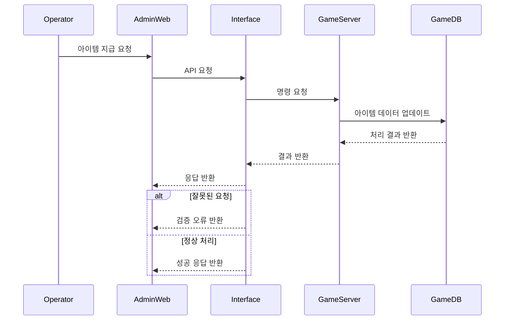

## 비즈니스 흐름

---

## 📌 흐름 설명

운영자가 아이템 지급 요청을 수행하면, 해당 요청은 Admin Web을 통해 Interface Server로 전달됩니다.

Interface Server는 요청을 검증하고, 내부 처리 규격에 맞게 변환한 후 Game Server로 전달합니다.
Game Server는 실제 게임 데이터베이스에 아이템 지급 처리를 수행합니다.

처리 결과는 동일한 경로를 통해 Admin Web으로 반환됩니다.

이 구조에서는 게임 서버가 외부 시스템에 직접 노출되지 않으며,
모든 요청은 반드시 Interface Server를 통해 전달됩니다.

---

## 🔐 Interface Server의 역할

Interface Server는 시스템 내에서 다음과 같은 핵심 역할을 수행합니다:

* 요청 검증 (권한 및 파라미터 검증)
* 요청 변환 (Admin 요청 → 게임 서버 내부 명령 형태 변환)
* 외부 시스템과 내부 게임 서버 간 통신 중계
* 모든 요청 및 결과에 대한 로깅 및 감사 기록 저장
* 에러 발생 시 응답을 표준화하여 전달

이를 통해 보안성과 운영 안정성을 동시에 확보할 수 있습니다.

---

## ⚠️ 오류 처리

아이템 지급 과정에서는 다음과 같은 오류 상황이 발생할 수 있습니다:

* 잘못된 사용자 ID 또는 요청 파라미터
* 게임 서버 내부 처리 실패
* 네트워크 통신 오류

이러한 경우 Interface Server는 오류를 수집하고 표준화된 형태로 변환하여 Admin Web에 전달합니다.
또한 모든 오류는 로그로 기록되어 추후 분석 및 대응이 가능하도록 설계되었습니다.

---

## 🔒 보안 고려 사항

* 게임 서버는 외부 네트워크와 완전히 분리되어 운영됩니다.
* 게임 서버에 대한 직접 접근은 불가능합니다.
* 모든 요청은 반드시 Interface Server를 통해 전달됩니다.
* 주요 운영 기능은 권한 검증을 거쳐 수행됩니다.

이와 같은 구조를 통해 외부 공격으로부터 시스템을 보호하면서도 안정적인 운영이 가능합니다.
