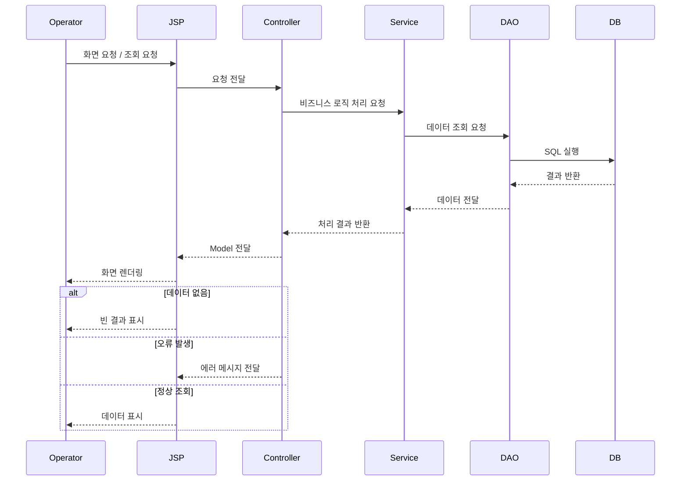

# 데이터 흐름

## 사용자 요청 흐름

---

## 📌 흐름 설명

운영자가 화면에서 데이터를 조회하면, 요청은 JSP를 통해 Controller로 전달됩니다.

Controller는 Service 계층에 비즈니스 로직 처리를 요청하고,
Service는 DAO를 통해 데이터베이스에 접근하여 데이터를 조회합니다.

조회된 데이터는 다시 Controller로 전달되며,
Controller는 해당 데이터를 Model에 담아 JSP로 전달합니다.

JSP는 전달받은 데이터를 기반으로 화면을 렌더링하여 사용자에게 보여줍니다.

---

## 🧩 설계 의도

* **MVC 패턴 기반 구조**
  Controller, Service, DAO 계층 분리를 통해 역할을 명확히 구분

* **서버 사이드 렌더링 구조**
  JSP를 활용하여 서버에서 직접 화면 생성

* **레이어드 아키텍처 적용**
  각 계층이 독립적으로 역할 수행

---

## ⚠️ 고려 사항

* 서버 부하 증가 가능성 (SSR 구조 특성)
* 화면과 비즈니스 로직 간 결합도 증가 가능성
* 대량 데이터 조회 시 성능 이슈 발생 가능

이에 따라 쿼리 최적화 및 페이징 처리 전략이 필요합니다.
